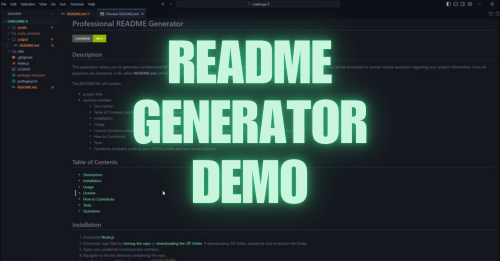
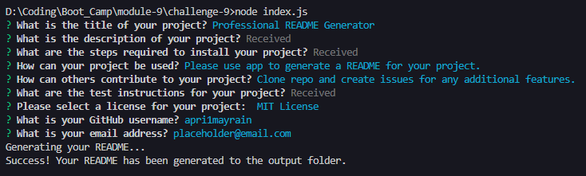
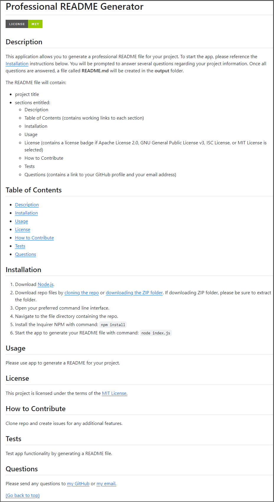

# Professional README Generator

## Table of Contents
- [Description](#description)
- [Features](#features)
- [Installation](#installation)
- [Demo](#demo)
- [Screenshots](#screenshots)
- [Credits](#credits)
- [License](#license)

## Description

This application allows you to generate a professional README file for your project. To start the app, please reference the [Installation](#installation) instructions below. You will be prompted to answer several questions regarding your project information. Once all questions are answered, a file called **README.md** will be created in the **output** folder. 

The README file will contain:
- project title 
- sections entitled:
    - Description
    - Table of Contents (contains working links to each section)
    - Installation
    - Usage
    - License (contains a license badge if Apache License 2.0, GNU General Public License v3, ISC License, or MIT License is selected)
    - How to Contribute 
    - Tests
    - Questions (contains a link to your GitHub profile and your email address)

## Features

* [Node.js](https://nodejs.org/en) to execute JavaScript in CLI or *outside* of web browser.
* [Built-in file system module](https://nodejs.org/api/fs.html) to write README file.
* [Inquirer v8.2.4](https://www.npmjs.com/package/inquirer) for interactive user input. In this app, three different types of input are used: editor, input, and list.

## Installation

1. Download [Node.js](https://nodejs.org/en).
2. Download repo files by [cloning the repo](https://docs.github.com/en/repositories/creating-and-managing-repositories/cloning-a-repository#cloning-a-repository) or [downloading the ZIP folder](https://github.com/apri1mayrain/readme-generator/archive/refs/heads/main.zip). If downloading ZIP folder, please be sure to extract the folder.
3. Open your preferred command line interface.
3. Navigate to the file directory containing the repo.
4. Install the Inquirer NPM with command: `npm install`
5. Start the app to generate your README file with command: `node index.js`

## Demo

Click photo below to view demo video:

## Screenshots

Terminal results:

Generated README:

## Credits

* Source code can be found at: [https://github.com/coding-boot-camp/potential-enigma](https://github.com/coding-boot-camp/potential-enigma)

## License

MIT License - Copyright © 2024 apri1mayrain

[(Go back to top)](#professional-readme-generator)